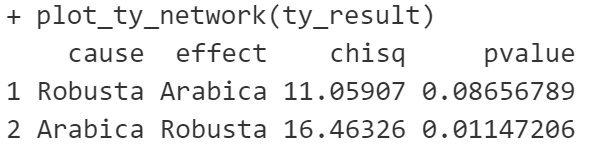
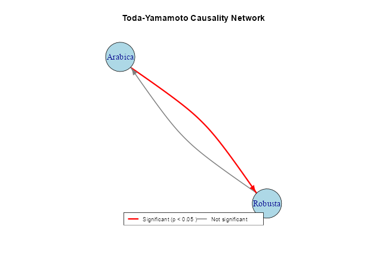

# grangertdyigraph

> Toda-Yamamoto Granger Causality Tests with Network Graph Visualization

## Description

`grangertdyigraph` is an R package that implements Toda-Yamamoto causality test (Toda & Yamamoto, 1995) and visualizes the results using network graph visualization. 

A time series X is considered a Granger cause of another time series Y if past values of X and Y predicts Y significantly better than past values of Y alone (Granger, 1969).

The concept and method of Granger causality was originally developed for stationary time series. The Toda-Yamamoto approach overcomes some issues that can arise when testing non-stationary series, a condition leading to the risk of spurious causality (He & Maekawa, 2001).

## Installation

You can install the development version of grangertdyigraph from GitHub with:

```r
# install.packages("devtools")
devtools::install_github("derisiswara/grangertdyigraph")
```

## Features

- Implement Toda-Yamamoto causality tests for time series with unit roots
- Provide robust analysis for non-stationary time series
- Create network graph visualizations of causality relationships
- Simplify interpretation of complex causality patterns

## Example

```r
library(grangertdyigraph)
# install.packages("vars")
library(vars)

# Create VAR model for coffee prices
var_model <- VAR(coffee_data[, c("Arabica", "Robusta")], p = 2, type = "both")

# Run Toda-Yamamoto causality test
ty_result <- toda_yamamoto(var_model)
print(ty_result)

# Visualize the results as a network graph
plot_ty_network(ty_result)
```





## References

This package is based on the Toda-Yamamoto causality test implementation from:

- [Nicola Righetti's Toda-Yamamoto-Causality-Test](https://github.com/nicolarighetti/Toda-Yamamoto-Causality-Test)

### Academic References

- Toda, H. Y., & Yamamoto, T. (1995). Statistical inference in vector autoregressions with possibly integrated processes. Journal of econometrics, 66(1-2), 225-250.
- Granger, C. W. J. (1969). Investigating Causal Relations by Econometric Models and Cross-spectral Methods. Econometrica, 37(3), 424-438.
- He, Z., & Maekawa, K. (2001). On spurious Granger causality. Economics Letters, 73(3), 307-313.

## License

This package is licensed under the MIT License.
